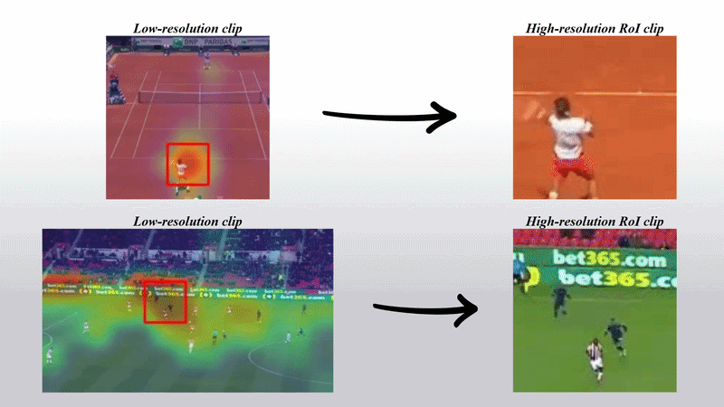

# AdaSpot
### AdaSpot: Spend Resolution Where It Matters for Precise Event Spotting (CVPR 2026)

<a href="https://pytorch.org/get-started/locally/"></a>
[](https://arxiv.org/abs/2602.22073)
[](https://arturxe2.github.io/projects/AdaSpot/)

This repository contains the PyTorch implementation of the paper:

**AdaSpot: Spend Resolution Where It Matters for Precise Event Spotting**<br>
*Artur Xarles, Sergio Escalera, Thomas B. Moeslund, and Albert Clapés*<br>
**The IEEE/CVF Conference on Computer Vision and Pattern Recognition 2026 (CVPR'26)**<br>


## Overview

Precise Event Spotting (PES) focuses on identifying the exact frame where a fast-paced event occurs, a task crucial in domains such as sports analytics. Existing methods often process all frames uniformly, wasting computation on irrelevant regions or downsampling frames and losing critical fine-grained details.

**AdaSpot addresses this challenge by**:
- Processing full frames at low resolution to capture global context 
- Adaptively selecting the most informative region per frame for high-resolution processing 
- Using a training-free, saliency-based RoI selector that avoids the instability of learning-based alternatives

✅ **The result**: state-of-the-art performance on PES benchmarks, including Tennis, FineDiving, and the broader SoccerNet Ball Action Spotting, while preserving fine-grained cues with minimal computational overhead. 




## Environment

All required dependencies are listed in `requirements.txt`. To install them in a Python or Conda environment, run:

```
python -m pip install -e . --no-deps
python -m pip install -r src/AdaSpot/requirements.txt
```

Run these commands from the parent Alpes repository. The editable install exposes
AdaSpot as `src.AdaSpot` and does not install its third-party dependencies.

## Data

Refer to the README files inside the [data](/data/) directory for dataset-specific preprocessing and setup instructions.

## Execution

The `main.py` script is used to train and evaluate **AdaSpot** according to the selected configuration file. Run the script as follows: 

```
python -m src.AdaSpot.main --model_name <model_name> --seed <seed>
```

Here, `<model_name>` follows the format `<dataset>_<name>`, where `<dataset>` is one of the possible datasets (FineDiving, Tennis, FineGym, F3Set, or SoccerNetBall), and `<name>` can be chosen freely but must match the name specified in the configuration file located in the config directory. The `<seed>` specifies the random seed (default `1`). 

For example, to train a small (200MF) model on the FineDiving dataset:

```
python -m src.AdaSpot.main --model_name FineDiving_small --seed 1
```

To control whether the model is trained or only evaluated, modify the `only_test` parameter in the configuration file. For detailed configuration options, refer to the README inside the [config](/config/) directory.

Before executing the model:
- Download the dataset frames.
- Update all directory-related paths in the relevant configuration files under [config](/config/).
- If using SoccerNet Ball Action Spotting, update the labels path in [util/constants](/util/constants.py).

Additionally, make sure to run the script once with the `mode` parameter set to `store` to generate and save the clip partitions for training. After this initial run, you can set the `mode` to `load` to reuse the saved partitions for subsequent executions.

## Trained models

Pretrained checkpoints are available on [Hugging Face](https://huggingface.co/arturxe/AdaSpot).

Configuration files are located in the [config](/config/) directory.

Using a checkpoint:
- Place the checkpoint file inside the directory specified by `save_dir` in the configuration.
- The checkpoint must be inside a folder named: `<model_name>-<seed>`

Note: Reported results in the paper are averaged over three runs with different seeds. The released checkpoints correspond to a single trained model, so minor performance variations may occur.

## Perform inference

You can perform inference on a single video using the `inference.py` script. Run it from the command line as follows:

```
python -m src.AdaSpot.inference --model_name <model_name> --video_path <video_path> --frame_width <frame_width> --inference_threshold <inference_threshold>
```

For example, to use a pre-trained FineDiving model:

```
python -m src.AdaSpot.inference --model_name FineDiving_small --video_path /videos/inference_video.mp4
```

Ensure that the specified trained model is accessible. The inference threshold can be adjusted according to your preference. 

## Contact

If you have any questions related to the code, feel free to contact arturxe@gmail.com.

## References

If you find our work useful, please consider citing our paper.
```
@inproceedings{xarles2026adaspot,
  title={AdaSpot: Spend Resolution Where It Matters for Precise Event Spotting},
  author={Xarles, Artur and Escalera, Sergio and Moeslund, Thomas B and Clap{\'e}s, Albert},
  booktitle={Proceedings of the IEEE/CVF Conference on Computer Vision and Pattern Recognition},
  year={2026}
}
```
